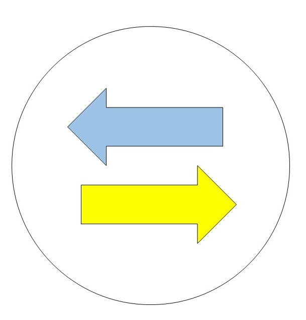

Mark Down Converter
===========
**Markdown Converter** is for translating '.md' file to various types of file. It will convert Markdown to HTML, PDF, SLIDE HTML, etc.
- - - -
###How To Use?
__A Java file__(option_input.java) is a tool for Markdown Converter.
In this program, basically we call '.md' file, and decide conversion type, Output's name, Output's style, and Where we saves. Now, our steps of developing is not enough for showing all options. Basically we design converter **'.md' -> 'html'**
- - - -
##Tool's Command:
```
mdconverter (-h) 
            {input_file} [options]
```
examples)
```
mdconverter Readme.md -o
mdconverter Hongshin.md -o -f -s
mdconverter -h
```
   * (-h): Show help messages. mdconverter -h.
```
***********Markdown Converter**********
mdconverter (-h)
            {input_file} [options]
***************************************
(-h): Show help message.

{input_file}: Input file's name. You have to put file's name extension too. (".md")
              If computer does not find input file, it will send error message.

[options]: [-o], [-f], [-s], [-1], [-2], [-3].

           [-o] : Option
           [-f] : Format
           [-s] : Style
            ---------- Shortkut Key Usage -----------
           [-1] : mdconverter 
           [-2] : Command 2
           [-3] : Command 3
```
   * {input_file}: Input File's name. If file does not exist, it will send error message.
```java
private static boolean inputFileExistance(String inFile){
   /*Checking existency of files in directory
   If file does not exist, call error message*/
  }
 ```
   * [options]: Choose options for converting '.md' file. This options does not impact by ordering. For example, '[-o] [-s] [-f]' shows same result with '[-f] [-s] [-o]'. And options cannot be run if user put wrong command(including {input_file}) or computer cannot find '.md' file. User can use both 'Upper' and 'Lower' alphabet.
       * -o: Output
       * -f: Format
       * -s: Style
       * -1: Command 1
       * -2: Command 2
       * -3: Command 3
   
----------
 __Caution__: Basically tool searches file in 'Tool's directory'. And if there is a same output's name in same directory, this tool will ask you a question that overwrite or not. if you put 'y or Y' command, it will overwrite, if you put 'n' or 'N' command, it will not overwrite.
 
----------
#Must be added:
 1. Detail Option(No file, Type, etc)
 2. Where to save, How can defie
 3. Command example
 4. Number(1,2,3)'s detail command
